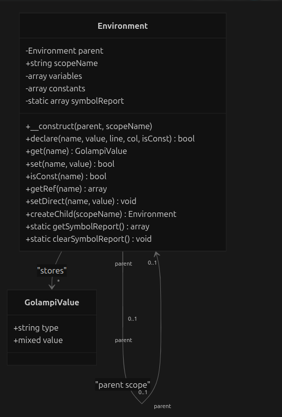
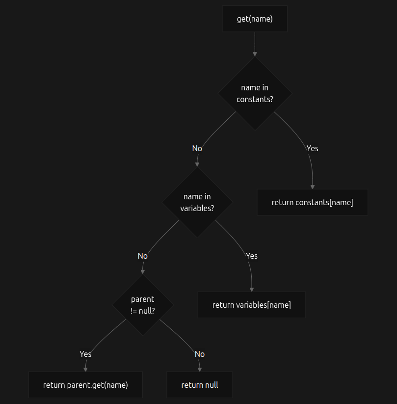

# Documentación del Lenguaje Golampi

## 1. Gramática Formal (Reglas Sintácticas)

La gramática de Golampi está diseñada para ser procesada por herramientas como ANTLR4, definiendo un lenguaje estructurado, fuertemente tipado y con soporte para punteros y arreglos. A continuación, se detallan las reglas de producción agrupadas por su función en el lenguaje.

### 1.1. Estructura del Programa y Bloques
Todo programa en Golampi es un conjunto de declaraciones globales (funciones, variables o constantes) evaluadas de arriba hacia abajo hasta encontrar el fin del archivo (`EOF`).
* **Programa:**
  `program : (functionDecl | varDeclStmt | constDeclStmt)* EOF`
* **Bloque de sentencias:**
  `block : LBRACE statement* RBRACE`

### 1.2. Tipos de Datos
Golampi soporta tipos primitivos, arreglos multidimensionales y punteros.
* **Tipos Primitivos:**
  `primitiveType : 'int32' | 'int' | 'float32' | 'bool' | 'rune' | 'string'`
* **Especificación de Tipo (General):**
  `typeSpec : primitiveType | arrayType | ('*' typeSpec)`
* **Tipo Arreglo:**
  `arrayType : ('[' expression ']')+ primitiveType`

### 1.3. Declaraciones
Las declaraciones permiten introducir nuevas variables, constantes y funciones al entorno actual.

* **Declaración de Funciones:**
  `functionDecl : 'func' IDENTIFIER '(' paramList? ')' returnType? block`
  * **Lista de parámetros:** `paramList : param (',' param)*`
  * **Parámetro:** `param : IDENTIFIER typeSpec | IDENTIFIER '*' typeSpec`
  * **Tipo de retorno:** `returnType : typeSpec | '(' typeSpec (',' typeSpec)* ')'` *(soporta retornos múltiples)*.

* **Declaración de Variables (Larga):**
  `varDeclStmt : 'var' idList typeSpec ('=' expressionList)?`
  `            | 'var' IDENTIFIER arrayType ('=' arrayLiteral)?`

* **Declaración de Variables (Corta / Inferencia):**
  `shortVarDeclStmt : idList ':=' expressionList`

* **Declaración de Constantes:**
  `constDeclStmt : 'const' IDENTIFIER typeSpec '=' expression`

### 1.4. Asignaciones y Modificadores
Las asignaciones actualizan el valor de variables previamente declaradas, arreglos o valores apuntados en memoria.
* **Sentencia de asignación:**
  `assignmentStmt : leftValue assignOp expression`
* **Valor izquierdo (L-Value):**
  `leftValue : IDENTIFIER ('[' expression ']')*` *(Variable o Arreglo)*
  `          | '*' IDENTIFIER` *(Desreferenciación de puntero)*
* **Operadores de Asignación:**
  `assignOp : '=' | '+=' | '-=' | '*=' | '/='`
* **Incremento / Decremento:**
  `incDecStmt : IDENTIFIER '++' | IDENTIFIER '--'`

### 1.5. Sentencias y Control de Flujo
El flujo del programa se controla mediante estructuras condicionales, cíclicas y de salto.
* **Tipos de sentencias válidas (`statement`):**
  Puede ser una declaración (`varDeclStmt`, `constDeclStmt`, `shortVarDeclStmt`), una asignación (`assignmentStmt`), control de flujo (`ifStmt`, `switchStmt`, `forStmt`), saltos (`returnStmt`, `breakStmt`, `continueStmt`), o expresiones directas (`expressionStmt`, `incDecStmt`).

* **Condicional If-Else:**
  `ifStmt : 'if' expression block ('else' ifStmt | 'else' block)?`

* **Selección Múltiple (Switch):**
  `switchStmt : 'switch' expression '{' caseClause* defaultClause? '}'`
  * **Caso:** `caseClause : 'case' expressionList ':' statement*`
  * **Defecto:** `defaultClause : 'default' ':' statement*`

* **Ciclos (For):**
  Soporta tres variaciones principales:
  1. **Clásico:** `forStmt : 'for' forInit? ';' expression? ';' forPost? block`
     *(Donde `forInit` puede ser `shortVarDeclInFor` o `assignmentStmt`, y `forPost` puede ser `assignmentStmt` o `incDecStmt`)*.
  2. **Condicional (While):** `forStmt : 'for' expression block`
  3. **Infinito:** `forStmt : 'for' block`

* **Sentencias de Transferencia:**
  * **Retorno:** `returnStmt : 'return' expressionList?`
  * **Ruptura y Continuación:** `breakStmt : 'break'` | `continueStmt : 'continue'`

### 1.6. Expresiones
Las expresiones en Golampi tienen reglas estrictas de precedencia (de mayor a menor prioridad):
1. **Agrupación y Accesos:** * Paréntesis: `'(' expression ')'`
   * Acceso a arreglos: `expression '[' expression ']'`
2. **Operadores Unarios y Punteros:**
   * Negación lógica: `'!' expression`
   * Menos unario: `'-' expression`
   * Referencia (obtener dirección): `'&' IDENTIFIER`
   * Desreferencia (obtener valor): `'*' expression`
3. **Aritméticas:**
   * Multiplicativas: `expression ('*' | '/' | '%') expression`
   * Aditivas: `expression ('+' | '-') expression`
4. **Relacionales y de Igualdad:**
   * Relacionales: `expression ('<' | '>' | '<=' | '>=') expression`
   * Igualdad: `expression ('==' | '!=') expression`
5. **Lógicas:**
   * AND lógico: `expression '&&' expression`
   * OR lógico: `expression '||' expression`

### 1.7. Funciones Nativas y Literales
El lenguaje incluye funciones incorporadas y define reglas claras para la instanciación de valores literales.
* **Llamada a funciones personalizadas:**
  `IDENTIFIER '(' argumentList? ')'`
* **Funciones Nativas:**
  * Imprimir: `fmt.Println '(' expressionList? ')'`
  * Longitud: `len '(' expression ')'`
  * Fecha actual: `now '(' ')'`
  * Subcadena: `substr '(' expression ',' expression ',' expression ')'`
  * Tipo de dato: `typeOf '(' expression ')'`
* **Arreglos Literales:**
  `arrayLiteral : '[' expression ']' primitiveType '{' expressionList? '}'`
  `             | '[' expression ']' arrayType '{' arrayInitList? '}'`
* **Literales (Valores terminales):**
  Pueden ser identificadores (`IDENTIFIER`), enteros (`INT_LIT`), flotantes (`FLOAT_LIT`), cadenas (`STRING_LIT`), caracteres (`RUNE_LIT`), booleanos (`true` | `false`) o el valor nulo (`nil`).

### 1.8. Elementos Léxicos (Tokens)
* **Identificadores:** `[a-zA-Z_][a-zA-Z0-9_]*`
* **Cadenas (Strings):** Empiezan y terminan con comillas dobles `"`, soportando secuencias de escape.
* **Caracteres (Runes):** Empiezan y terminan con comillas simples `'`, soportando literales unicode `\uXXXX`.
* **Ignorados (Skip):** Espacios en blanco, tabulaciones, saltos de línea (`WS`), comentarios de una línea (`//`) y comentarios multilínea (`/* ... */`).

## 2. Diagrama de Clases del Intérprete (AST)

## 3. Diagrama de Flujo de Procesamiento (Tabla de Símbolos)

El manejo de ámbitos (*scopes*) y la Tabla de Símbolos en Golampi se realiza a través de entornos encadenados (`Environment`). El siguiente diagrama de flujo ilustra el proceso interno de **Búsqueda (Resolución)** y **Declaración** de variables y constantes.
