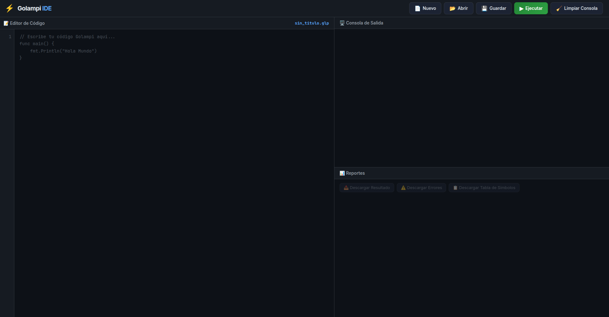
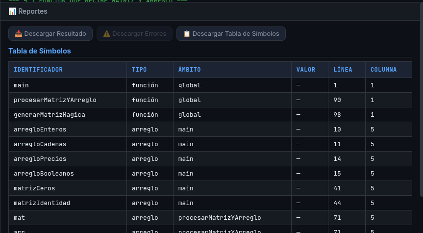
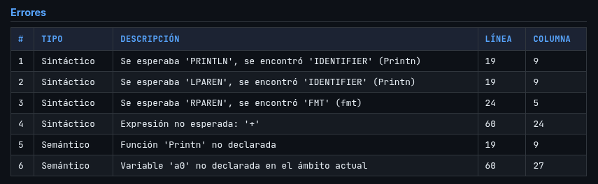

# Manual de Usuario - Intérprete Golampi

Este manual describe el proceso paso a paso para instalar, configurar y utilizar el intérprete del lenguaje **Golampi**, así como la guía para interpretar los resultados y reportes generados por la herramienta.

---

## 1. Instalación y Configuración

Para ejecutar la herramienta localmente, asegúrese de cumplir con los siguientes requisitos previos:
* **PHP 8.0 o superior** instalado y configurado en sus variables de entorno.
* **Composer** (Manejador de dependencias de PHP).
* Un navegador web moderno.

### Pasos de Instalación:
1.  **Obtener el proyecto:** Clone el repositorio o descargue el código fuente y descomprímalo en su computadora.
2.  **Instalar dependencias:** Abra una terminal, navegue hasta la carpeta `backend` del proyecto y ejecute el siguiente comando para instalar el runtime de ANTLR4:
    ```bash
    cd backend
    composer install
    ```
3.  **Levantar el servidor local:** En la misma terminal (dentro de la carpeta `backend`), ejecute el servidor web integrado de PHP:
    ```bash
    php -S localhost:8000
    ```
    
4.  **Abrir la interfaz:** Abra su navegador web e ingrese a: http://localhost:8000/.

---

## 2. Uso de la Herramienta (IDE Web)

La interfaz gráfica proporciona un entorno amigable para escribir y probar código escrito en Golampi.

### Crear, Editar y Ejecutar Código
1.  **Escribir código:** Utilice el área de texto principal (Editor) para escribir su código fuente en Golampi desde cero.
2.  **Cargar un archivo:** Si dispone de un archivo `.go` (por ejemplo, `test_completo.go`), utilice la opción "Abrir Archivo" / "Cargar Archivo" para volcar su contenido automáticamente en el editor.
3.  **Ejecutar:** Una vez que el código esté listo, presione el botón **"Ejecutar"**. Esto enviará el código al backend para su análisis léxico, sintáctico y ejecución semántica.
4.  **Visualizar Salida:** Debajo del editor, el panel de **"Consola"** mostrará las salidas generadas por el programa (como impresiones de `fmt.Println()`) o los mensajes de finalización.



---

## 3. Interpretación de Reportes

Una vez finalizada la ejecución, el sistema genera reportes detallados para facilitar la comprensión del estado de la memoria y la depuración del código.

### 3.1. Reporte de Tabla de Símbolos
Este reporte muestra el estado final de la memoria y el seguimiento de todas las entidades declaradas en el programa.

* **ID (Nombre):** El identificador con el que se declaró la variable, constante o función.
* **Tipo:** El tipo de dato almacenado (`int32`, `float32`, `string`, `bool`, `rune`, `arreglo` o `función`).
* **Ámbito (Scope):** El entorno donde vive la variable (ej. `global`, `main`, `if_block`, `for_loop`). Útil para detectar problemas de alcance o *shadowing*.
* **Valor:** El valor final calculado por el intérprete en tiempo de ejecución.
* **Línea y Columna:** La ubicación en el código fuente donde el símbolo fue declarado.



### 3.2. Reporte de Errores
Si el código contiene fallos, la ejecución se detendrá o registrará las anomalías en la tabla de Errores.

* **Tipo de Error:**
    * *Léxico:* Caracteres no reconocidos por el lenguaje (ej. `@`, `#`).
    * *Sintáctico:* Estructuras mal formadas (ej. falta de llaves `{}`, paréntesis `()` o palabras reservadas mal escritas).
    * *Semántico:* Operaciones lógicamente inválidas (ej. división por cero, incompatibilidad de tipos en operaciones aritméticas, uso de variables no declaradas o reasignación de constantes).
* **Descripción:** Un mensaje claro y detallado del problema encontrado por el analizador.
* **Línea y Columna:** Las coordenadas exactas en el editor donde ocurrió el error, lo que permite una corrección rápida.

